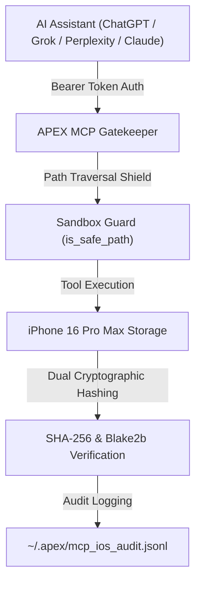

# APEX Apple & iOS Sovereign MCP Toolbelt Matrix

**Target Hardware:** iPhone 16 Pro Max / iPad Pro / macOS Ecosystem  
**Server Component:** `apex_ios_mcp_fortress.py` (v5.0 Sovereign Engine)  
**Protocol Compatibility:** Standard Model Context Protocol (MCP v1.0) & JSON-RPC 2.0  

---

## 🛠️ The Complete 8-Tool Sovereign MCP Toolbelt

| MCP Tool Name | Function & Purpose | Evidentiary Anchor | Security Boundary |
| :--- | :--- | :--- | :--- |
| **`list_dir`** | Safely inspect directory listings, file sizes, and folder hierarchies. | Directory state snapshot | Sandbox boundary check (`is_safe_path`) |
| **`read_file`** | Read file content with dual cryptographic hash verification. | Dual SHA-256 + Blake2b | 500k char limit + Sandbox check |
| **`write_file`** | Write or overwrite files safely on iPhone 16 Pro Max storage. | Post-write SHA-256 audit | Directory auto-creation + Sandbox check |
| **`append_file`** | Append logs, telemetry, or case notes without overwriting. | Incremental hash update | Sandbox boundary check |
| **`delete_file`** | Remove temporary files or scratch space cleanly. | Audit trail log entry | Explicit sandbox verification |
| **`file_info`** | Retrieve full file stats, mtime, byte size, and dual hashes. | Verification certificate | Realpath verification |
| **`search_files`** | Search iOS storage for target filenames matching a query. | Traversal log record | Clamped to sandbox root |
| **`grep_file`** | Search text patterns or keywords inside target files. | Line-level match logs | Read buffer safety limits |

---

## 🔒 Security & Hardening Architecture

---

## 📱 Hardware & Execution Hardening

1. **Persistent Power & Network Lock (`termux-wake-lock`):**
   - Active CPU wake lock prevents process suspension when closing the keyboard or switching apps on iOS/Termux.
2. **Auto-Healing Dual Socket Server:**
   - 128k socket buffer with 5-second socket timeout guard to prevent network starvation.
3. **Repository Preservation:**
   - Synced to [GlacierEQ/ish/mcp/apex_ios_mcp_fortress.py](https://github.com/GlacierEQ/ish/tree/master/mcp).
